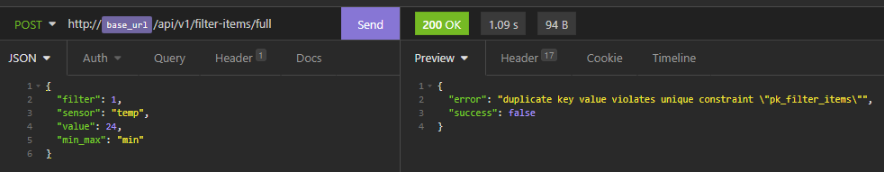
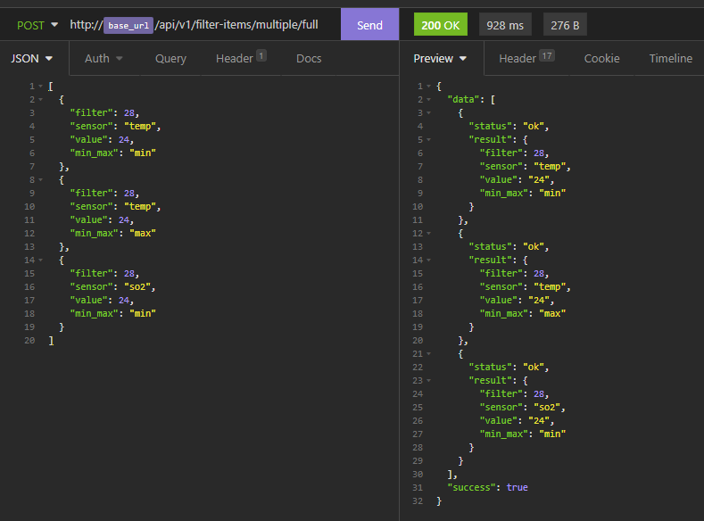
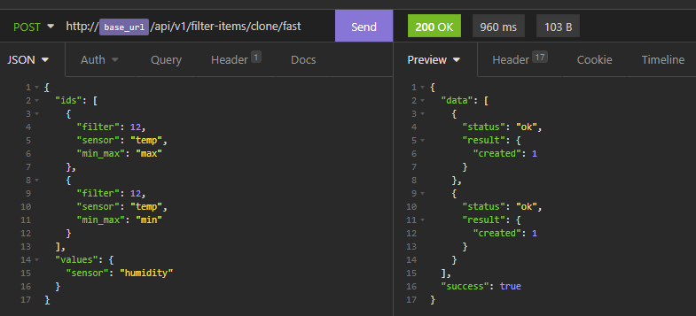

# Airduino REST API

version 1.0

This is a Nodejs (TypeScript 3.x) implementation of REST API for Airduino project on PostgreSQL database.

It implements following resources:

- devices
- devicetypes
- owners
- firmwares
- configurations
- configurationitems
- regiontypes
- regions
- data
- telemetry
- translations
- dictionary
- filters
- filter items

It uses cache for all enabled device's apikeys.

Also, the plan is to implement REST API for resources:

- events
- rules
- actions

Also, plan is to implement session based APIs, SSL and user privileges.

This is server side subproject of Airduino project - air quality measurement based on arduino MCU models.
Edge telemetry is on [Air Quality Monitor](https://github.com/tihomirmagdic/air-quality-monitor)

There are scripts in package.json for easy development.

First ensure clean .js, and .sql folders in /dist folder with clean script:

```
npm run clean
```

After cleaning, copy all .sql files:

```
npm run copy:assets
```

In development watch and copy in (/src) folder for any changes for .sql files:

```
npm run watch:assets
```

Finally, run transpiling on every change of .ts file from development folder (/src) into .js in distribution folder (/dist):

```
npm run dev
```

## For all resources there is standard (internal) with following rules

Rules marked with EX are experimental and available only for specific resources.

POST - search and create new objects

- search by id
- create single object
- create multiple objects EX
- copy single objects EX
- copy multiple objects EX

PUT - update existing objects

- update multiple objects by id's
- update multiple objects by values EX

DELETE - delete existing objects

- delete multiple objects

### POST

#### Search

Retrieves all objects with id in ids attribute.

JSON in body

```
{
  "ids": [
    { }, // id of object 1
    { }, // id of object 2
    { }, // id of object 3
  ]
}
```

```
POST <base url><resource>
```


#### Create single object

Request contains values to create an object with. Other values may be auto generated on back-end side.

JSON in body

```
{ // values of new object
  ...
}
```

There're three version for response type:

```
POST <base url><resource>/full
```

The reponse contains all the values of the created object.


##### POST <base url><resource>/id

The reponse contains only id value(s) of the created object.


##### POST <base url><resource>/fast

The reponse contains only status of the created object ("success": true | false).


##### Error during creating new object

If error occurs during creating new object, the response contains error message and false as "success" status.



#### Create multiple objects

Create multiple objects with requested values.
Similary as in single object creation, request contains object values for creating multiple objects. Objects' values are in array of object's values.

JSON in body

```
[
  { }, // values of new object 1
  { }, // values of new object 2
  { }, // values of new object 3
  ...
]
```

There're three version for response type:

##### POST <base url><resource>/multiple/full

The reponse contains values of created objects, also in array of values.



##### POST <base url><resource>/multiple/id

The reponse contains only id value(s) of the created objects in array.


##### POST <base url><resource>/multiple/fast

The reponse contains only status of the created objects ("status": "ok" | "error") in array, and number of created object in result.created property.

In the following example creation of the first object failed with false in "status" property and error object contains code, detail, and constraint.


#### Copy single objects

To copy an object request should contain id of a object to copy. In addition to the object id, other values that we want to have in the new copied object can be specified.

JSON in body

```
{ // id of the existing object to copy and values of new object
  ...
}
```

There're three version for response type:

##### POST <base url><resource>/copy/full

The reponse contains values of created object.

In this example request contains object id only.


The reponse contains object id with values of new object.


##### POST <base url><resource>/copy/id

The reponse contains only id value(s) of the created object.


##### POST <base url><resource>/copy/fast

The reponse contains only status of the created object ("status": "ok" | "error") in array, and number of created object in result.created property.


#### Copy multiple objects

To copy multiple objects request should contain id's of objects to copy in "ids" property as array. In "values" property are all values (incuding id attibutes) that we want to have in the new copied objects.

JSON in body

```
{
  "ids": [ // id's of the existing objects to copy
    {},
    {},
    {},
  ],
  "values": { // common values of new copied objects (may include properties of object's id)
    ...
  }
}
```

There're three version for response type:

##### POST <base url><resource>/clone/full

The reponse contains values of created object.


##### POST <base url><resource>/clone/id

The reponse contains only id value(s) of the created object.


##### POST <base url><resource>/clone/fast

The reponse contains only status of the created object ("status": "ok" | "error") in array, and number of created object in result.created property.



### PUT

#### Update multiple objects by id's

To update multiple objects by id's request should contain id's of objects to update in "ids" property as array. In "values" property are all values (may incude id attibutes) that we want to have in the updated objects.

JSON in body

```
{
  "ids": [ // id's of the existing objects to update
    {},
    {},
    {},
  ],
  "values": { // common values of updated objects (may include properties of object's id)
    ...
  }
}
```

There're three version for response type:

##### PUT <base url><resource>/full

The reponse contains values of updated object.


##### PUT <base url><resource>/id

The reponse contains only id value(s) of the updated object.


##### PUT <base url><resource>/fast

The reponse contains only status of the updated object ("success": true | false), and number of updated objects in data.updated property.


#### Update multiple objects by values

To update multiple objects by values request should contain array of values of objects including object id to update. It recognizes properties of object id to retrieve object to update and properties of other object values to update these values.

JSON in body

```
[
  { }, // values of new object 1
  { }, // values of new object 2
  { }, // values of new object 3
  ...
]
```

There're three version for response type:

##### PUT <base url><resource>/multiple/full

The reponse contains values of updated objects in array.


##### PUT <base url><resource>/multiple/id

The reponse contains only id value(s) of the updated objects in array.


##### PUT <base url><resource>/multiple/fast

The reponse contains only status of the updated object ("success": true | false), and number of updated objects in data.updated property.


### DELETE

#### Delete multiple objects

To delete multiple objects request should contain id's of objects to delete in "ids" property as array.

##### delete <base url><resource>


As some objects are not found, data.deleted property in response has number of successfully deleted objects (without error).


